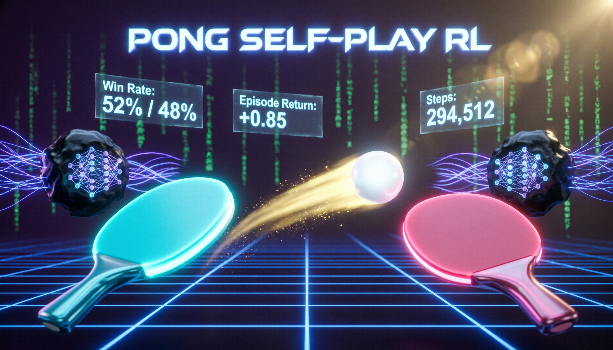
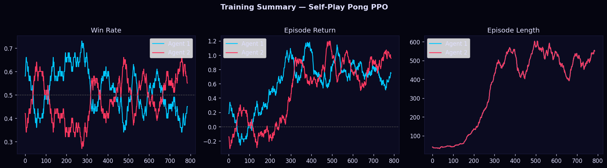

# 🏓 Pong Self-Play Reinforcement Learning

<p align="center">
  
</p>

<p align="center">
  
  
  
  
  
  
</p>

Two independent PPO agents learn to play Pong **from scratch**, competing against each other in a fully custom environment — no OpenAI Gym, no ALE, just raw PyTorch. Training is fully recorded and exported as a cinematic speed-ramped **MP4 video** capturing the entire learning arc.

---

## 📺 Training Video

> 3,208 frames · 90 FPS output · ~35 seconds · 3× accelerated

The video captures a demo episode every **15,000 steps**, so you can literally watch both agents go from random flailing to coordinated rallies over 300,000 training steps.

---

## ✨ Highlights

- **Zero external RL libraries** — PPO implemented from scratch in pure PyTorch
- **Custom Pong engine** — spin mechanics, speed escalation, rally bonuses
- **Dual independent agents** — each with its own Actor-Critic network, optimizer, and rollout buffer
- **Live training dashboard** — win rate, episode return, policy loss, and entropy curves rendered into every video frame
- **Cinematic video export** — full training history → `pong_training_cinematic.mp4` via `imageio-ffmpeg`
- **Colab-native** — one file, runs on a free T4 GPU in ~28 minutes

---

## 🧠 Algorithm — Proximal Policy Optimisation (PPO)

Each agent is an independent PPO learner. No parameter sharing between agents.

| Component | Detail |
|---|---|
| Network | 3-layer MLP · LayerNorm + GELU · Orthogonal init |
| Input | 8-dim observation vector (normalised) |
| Output | Actor logits (3 actions) + Critic scalar value |
| Advantage | Generalised Advantage Estimation (GAE, λ=0.95) |
| Clip ε | 0.2 |
| Entropy coef | 0.02 |
| Value coef | 0.5 |
| PPO epochs | 6 per rollout |
| Batch size | 256 |
| Rollout steps | 1,024 |
| Learning rate | 3e-4 with linear annealing |
| Gradient norm clip | 0.5 |

### Observation Space (per agent, 8-dim)

Each agent receives a mirrored view of the world, so both agents use identical policy logic regardless of which side they play on.

```
[ ball_x,  ball_y,  ball_vx,  ball_vy,
  own_paddle_y,  opp_paddle_y,  dist_to_ball,  approach_signal ]
```

### Action Space

| Index | Action |
|---|---|
| 0 | Move UP |
| 1 | STAY |
| 2 | Move DOWN |

---

## 🎮 Custom Pong Environment

The environment is implemented from scratch with several design choices to accelerate learning:

- **Ball spin** — paddle hit offset adds angular velocity, rewarding precise positioning
- **Speed escalation** — ball speeds up 4% on every paddle contact, capped at `ball_speed_max = 7.0`
- **Rally bonus** — both agents receive a small reward bonus for rallies ≥ 5 hits
- **Symmetric observations** — Agent 2 sees a horizontally flipped world, enabling zero-shot policy transfer between sides

---

## 📊 Training Results

Trained on **Google Colab T4 GPU** (`15.6 GB VRAM`).

| Metric | Value |
|---|---|
| Total timesteps | 300,000 |
| Training time | ~27.6 minutes |
| Speed | ~187–237 steps/sec |
| Agent-1 final win rate | 0.450 |
| Agent-2 final win rate | 0.550 |
| Recorded demo frames | 3,208 |
| Video duration | ~35.6 s (3× speed) |

<p align="center">
  
</p>

### Training Log (every 50 episodes)

```
step= 74,752 | ep=  400 | WR1=0.56 WR2=0.45 | ret1=+0.75 ret2=+0.92 | kl=0.0049 | 237 sps | 5.3 min
step=181,248 | ep=  600 | WR1=0.47 WR2=0.54 | ret1=+0.76 ret2=+0.93 | kl=0.0019 | 182 sps | 16.6 min
step=208,896 | ep=  650 | WR1=0.49 WR2=0.51 | ret1=+0.91 ret2=+0.75 | kl=0.0013 | 187 sps | 18.6 min
step=229,376 | ep=  700 | WR1=0.54 WR2=0.47 | ret1=+0.76 ret2=+0.56 | kl=0.0035 | 178 sps | 21.5 min
```

Both agents converge to a near **50/50 win rate** — a hallmark of healthy self-play dynamics where neither agent can dominate permanently.

---

## 🚀 Quickstart — Google Colab

1. Open a new Colab notebook
2. Set runtime: **Runtime → Change runtime type → T4 GPU**
3. Upload `pong_selfplay_rl.py` or clone this repo:

```bash
!git clone https://github.com/Erin-0/Pong-Self-Play-Reinforcement-Learning
%cd Pong-Self-Play-Reinforcement-Learning
```

4. Run training:

```bash
!python pong_selfplay_rl.py
```

5. When complete, the video auto-downloads to your browser:
   ```
   📥 Triggering browser download for: ./pong_project/pong_training_cinematic.mp4
   ```

> **Tip:** To train faster, the default config uses 300,000 steps (~28 min on T4). For stronger agents, increase `total_timesteps` to 600,000 in the `Config` dataclass.

---

## 📁 Output Files

All outputs are saved to `./pong_project/`:

| File | Description |
|---|---|
| `pong_training_cinematic.mp4` | Full training history video (3× speed, 90 FPS) |
| `agent1_final.pt` | Agent 1 model weights + optimizer state |
| `agent2_final.pt` | Agent 2 model weights + optimizer state |
| `training_summary.png` | Win rate · Return · Episode length plots |

---

## 🔄 Loading a Trained Agent

```python
import torch
from pong_selfplay_rl import ActorCritic, PongEnv, DEVICE

# Load
checkpoint = torch.load('pong_project/agent1_final.pt', map_location=DEVICE)
net = ActorCritic().to(DEVICE)
net.load_state_dict(checkpoint['model_state'])
net.eval()

# Play
env = PongEnv()
obs1, obs2 = env.reset()

with torch.no_grad():
    action, _, _ = net.act(obs1)
```

---

## ⚙️ Configuration

All hyperparameters live in the `Config` dataclass at the top of `pong_selfplay_rl.py`:

```python
@dataclass
class Config:
    total_timesteps:    int   = 300_000   # increase for stronger agents
    lr:                 float = 3e-4
    rollout_steps:      int   = 1024
    ppo_epochs:         int   = 6
    record_every_steps: int   = 15_000    # how often to capture a demo frame
    video_speedup:      float = 3.0       # final video speed multiplier
    ...
```

---

## 📦 Dependencies

```
torch >= 2.0
numpy
matplotlib
imageio
imageio-ffmpeg
```

Install:
```bash
pip install imageio imageio-ffmpeg
# torch and numpy are pre-installed in Colab
```

---

## 🗺️ Project Structure

```
Pong-Self-Play-Reinforcement-Learning/
├── pong_selfplay_rl.py          # Full training script (single file)
├── pong_project/
│   ├── pong_training_cinematic.mp4
│   ├── agent1_final.pt
│   ├── agent2_final.pt
│   └── training_summary.png
├── training_summary.png         # Summary plot (shown above)
├── pong_selfplay_banner.png     # Banner image
└── README.md
```

---

## 🔬 Key Design Decisions

**Why no Gym/ALE?** Building the environment from scratch gives full control over observation design, reward shaping, and spin mechanics — and removes the overhead of frame-stacking pixel observations, making training much faster on Colab's free tier.

**Why self-play?** A static opponent (rule-based or frozen) would create a non-stationary target as the learning agent improves. Self-play ensures the opponent is always at roughly the same skill level, providing a natural curriculum.

**Why mirrored observations?** Giving Agent 2 a horizontally flipped view means both agents learn the same generalised "intercept and return" policy regardless of which side they're on. This halves the effective sample complexity.

**Win rates converging to ~0.50** is the expected and desired outcome in symmetric self-play — it indicates both agents are learning and neither has collapsed.

---

## 📈 Possible Extensions

- [ ] Increase `total_timesteps` to 600k–1M for sharper play
- [ ] Add LSTM to the network trunk for memory-based anticipation
- [ ] Implement **league training** (agent pool with historical checkpoints)
- [ ] Export agent as ONNX for browser-based inference
- [ ] Add a human-playable evaluation mode

---

## 📄 License

MIT — free to use, modify, and distribute.

---

<p align="center">
  Made with PyTorch · Trained on Google Colab T4 GPU
</p>
